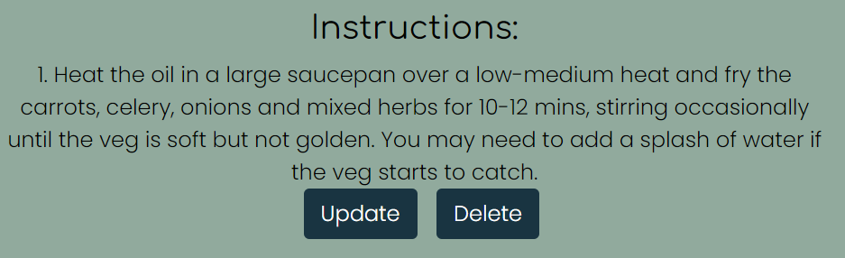

# Recipe Rustlers

This websites was created with the perpose to help people find there new favroutie recipes. Users logged in will be able to share there favourties recipes with the community and create a list of the recipes they have liked. 

(live version here)

***

## User Expierences 
### First time user goal
- To see all published recipes on the website. By most liked and most recent.
- To be able to search the website for recipe titles. 
- To click on a recipe and to see the full instructions and ingredients. They will also be able to see the comments written by other users of the website.

### Signed in user goal
- To be able to take part in discussion underneth recipes. 
- To be able to add there own recipe add to set it live to be seen by other users of the website.
- To be able to edit or delete anything they have added to the website.

***

## User Stories

- Manage recipes: As a Admin I can CRUD recipes so that I can manage the website
- View comments: As a Site User / Admin I can view comments on individual recipes so that I can see the response from the community
- View likes: As a Site user / Admin I can view the number of likes on each recipe so that I can see the most popular
- Draft recipes: As a Site user I can draft my recipes I wish to add so that I don't have to complete the task in one sitting
- Site list: As a Site User I can view a list of recipes so that I can select one to read
- Open a recipe: As a Site User I can click on a recipe so that I can view the full recipe
- Account registration: As a Site User I can register an account so that I can comment and like and post my own recipes
- Comment on a recipe: As a Site user I can leave comments on a recipe so that I can let the community know about my experience
- Like / unlike: As a Site user I can Like and unlike a recipe so that I can interact with the content

## Agile development 

I have recorded the

## Mockups 

Before i started creating the website i created 3 mockups to set out my style and edited these mockups for all other pages.

## Features

- ### Navbar and Footer
    - #### Navbar
        - Positioned at the top of the page the navbar will always be visible to the user. Allowing them to always be able to navigate the website with speed.
        - The navbar is always displayed at the top of the screen even if the user scrolls down the page.
        - The tabs Recipe Rustler, New recipe, Popular recipes, Register, Login, Hearted recipes, Add a recipe, Your recipes, and Logout each contain a link takes the user to a unique page.
        - When the user hovers over a link the background colour of the button changes to a differnt colour to show which tab they will be selecting.
        - The search bar allows the user to seach for the name of all recipes on the website if they are after a particulatr dish.
        - The navbar will also collapse down to a dropdown list access by a button when the screen size falls below a specified width.
        

        - ##### Navbar not signed in
            - When the user is not signed in the navbar shows a reduce number of tabs these are: Recipe Rustler, New recipe, Popular recipes, Register, Login, and the search function.
            - The reason these tabs are shown is because they do not require the user to have an account to access the pages the links go to. 
            

        - ##### Navbar signed in
            - When the user has an account and is signed in the navbar shows the tabs: Recipe Rustler, New recipe, Popular recipes, Hearted recipes, Add a recipe, Your recipes, Logout and the search function.
            

    - #### Footer
        - Positioned at the bottom of the screen the footer contains the information on when the website was created and links to social media accounts shown by there logos for users to engage even more with the community. 
        - When the user hovers over one of the social media accounts the logo chnages colour to show the user which website they will go to. 
        - As these links are not part of our website when clicked they will open in a different tab allowing the user to still remain on our website.
        

- ### Home page
    - #### Hero images
        - This is positioned just underneth the Navbar. It is a collage of bright and colourful pictures of images. 
        - These images should peak the users interest for more taste recipes and keep them on the site.
        

    - #### Title and ethos
        - The title and ethos introdueces the user the the website. It also explains why this website excits and includes the company slogan.
        
    
    - #### Twelve random recipes
        - This part of the homepage loads twelve random recipes to give the user an overview of the type of recipes on the site. 
        - Each of the twelve recipes are in an individual card showing the overall information e.g the image, title, dish type, prep and cooking time, author, date recipe was created, and number of likes. This allows the user to quickly get an impresson of each of the recipes shown. 
        

- ### New recipes 
    - This page orders all recipes added to the website by the most recent to earliest. 
    - This page has a pagination of 12 as to not overload the user and displays a next and previous button at the bottom of the page when appropriate.
    

- ### Popular recipes
    - This page orders all recipes added to the website by the most likes. 
    - This page has a pagination of 12 as to not overload the user and displays a next and previous button at the bottom of the page when appropriate.
    

- ### Hearted recipes
    - This page is only shown to users logged in. It shows a list of recipies they have liked so they can easily find recipes they have enjoyed. 
    - The recipes on this page are organised by title.
    - This page has a pagination of 12 as to not overload the user and displays a next and previous button at the bottom of the page when appropriate. As this account has only liked five recipes the next button has not appeared.

        

- ### Recipe details
    - This page shows when a user clicks on a recipe title. 
    - This then displays the overview information along with the instructions and ingredients for the recipe. 
    - At the bottom of the page the comments are recorded. They show the comment, poster and the date the comment was posted. It is ordered by the earliest comment posted to latest comment. This allows the user to read the comments as they were written. 
    - The ability to post a comment is next to the comments however this only appears when the user is logged into their account. 
    - If the user post a comment the comment will have two buttons below it one to update their comment and one to delete there comment. This means if they whish to change what they've said or remove there comment altogether that they have the freedom to do so. 
    

    - #### Delete comment
        - If the user clicks on the delete option for there comment a pop-up appears asking them to confirm they wish to delete the comment. This stops users accidently deleting there comments. Once clicked it takes the user back to the home page. 

            

    - #### Update comment
        - If the user clicks to update their comment they are taken to a new page. Here the comment is filled out so the user can edit an indivdual part of their comment instead of having to write the entier comment again. They then select 'Update' and are taken back to the home page. 
        

- ### Add a recipe 
    - This page allows a signed in user to add their own recipe. One this page they first fill out the overview information. 
    - They fill out the title explaining what the recipe is. 
    - The image is next if no image is uploaded then a filler 'no-image' is displayed for the recipe.
    - Status is the option between 'Draft' and 'Published'. If 'Draft' is selected then the recipe is no visable to the other user of the website. If 'Published' is selected then the recipe is shown like the other published recipes. 
    - Survings is to explain how many the recipe will feed.
    - Dish is an option between: 'Breakfast', 'Lunch', 'Snack', 'Dinner', and 'Dessert'. This helps other users to know what a recipe is for. 
    - Finally is prep and cook time in minutes. 
    - The submit button takes the user to the next page for the ingredient and instruction sections.
     

- ### Add a recipe details 
    - Once the 'Add a recipe' has been completed. This page is shown, it displays the overview information at the top in the same layout as the 'Recipe detail' page. This is to keep consistence across the website.
    - Next is ingredients which are added by ingredient name, weight, and unit. When each ingredient is added by pressing the 'Add +' button it is shown to the right of the screen. This is so the user can keep track of which ingredients they have added. 
    - Next is instructions which are added by 'step' then 'detail' this is also displayed to the right once the 'Add +' is pressed. This is so the user can keep track of which instructions they have added. 
    - Below the top of the screen is a 'Save recipe' button once the ingredients and instructions have been added. This takes the user to the 'Your recipes' page.
    
    

- ### Your recipes 
    - This page shows the user all their created recipes both Drafts and Published. This lets the user pick up a draft recipe if they dont have time to finish adding the recipe in one sitting. 
    - The recipes are shown by alphabetical order by their titles. 
    - This page has a pagination of 12 as to not overload the user and displays a next and previous button at the bottom of the page when appropriate. As this user has only added two recipes the next button has not appeared. 
    

- ### Your recipes detail
    - This page is only accessed through the Your recpie page. This page lets the user edit or delete the recipe overview or each individual instruction and ingredient.
    
    

    - #### Update recipe overview
        - The 'Update recipe overview' button takes you to this page. 
        - This page shows the form for the recipe overview. It is filled in with the existing data to save the user from re-entering the data. 
        - Once the data has been updated the user can click the 'Update' button and it will take the user back to the 'Your recipes' page. 
        

    - #### Delete recipe
        - If the user clicks on the 'Delete recipe' option for their recipe a pop-up appears asking them to confirm they wish to delete the recipe. This stops the users accidently deleting their recipe. Once clicked it takes the user back to the 'Your recipe' page.

            

    - #### Add Instructions or Ingredients
        - If a user click on the 'Add Instructions or Igredients' it takes them to the 'Add a recipe details'. 

            

    - #### Update instructions 
        - The 'Update' button takes you to this page. 
        - This page shows the form for the instruction. It is filled in with the existing data to save the user from re-entering the data. 
        - Once the data has been updated the user can click the 'Update' button and it will take the user back to the 'Your recipes' page. 
        

    - #### Delete instructions 
        - If the user clicks on the 'Delete' option for their instruction a pop-up appears asking them to confirm they wish to delete the instruction. This stops the users accidently deleting their instruction. Once clicked it takes the user back to the 'Your recipe' page.

            

    - #### Update ingredients 
        - The 'Update' button takes you to this page. 
        - This page shows the form for the ingredient. It is filled in with the existing data to save the user from re-entering the data. 
        - Once the data has been updated the user can click the 'Update' button and it will take the user back to the 'Your recipes' page. 
        

    - #### Delete ingredients 
        - If the user clicks on the 'Delete' option for their ingredient a pop-up appears asking them to confirm they wish to delete the ingredient. This stops the users accidently deleting their ingredient. Once clicked it takes the user back to the 'Your recipe' page.

            

- ### Search bar 
    - If the user searches for a recipe it will take them to this page. 
    - This page has a pagination of 12 as to not overload the user and displays a next and previous button at the bottom of the page when appropriate. As this search has only shown one recipe the next button has not appeared. 
    
