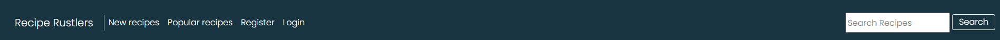
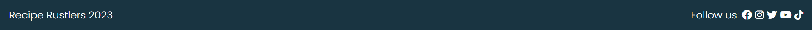

# Recipe Rustlers

This websites was created with the perpose to help people find there new favroutie recipes. Users logged in will be able to share there favourties recipes with the community and create a list of the recipes they have liked. 

(live version here)

***

## User Expierences 
### First time user goal
- To see all published recipes on the website. By most liked and most recent.
- To be able to search the website for recipe titles. 
- To click on a recipe and to see the full instructions and ingredients. They will also be able to see the comments written by other users of the website.

### Signed in user goal
- To be able to take part in discussion underneth recipes. 
- To be able to add there own recipe add to set it live to be seen by other users of the website.
- To be able to edit or delete anything they have added to the website.

***

## User Stories

- Manage recipes: As a Admin I can CRUD recipes so that I can manage the website
- View comments: As a Site User / Admin I can view comments on individual recipes so that I can see the response from the community
- View likes: As a Site user / Admin I can view the number of likes on each recipe so that I can see the most popular
- Draft recipes: As a Site user I can draft my recipes I wish to add so that I don't have to complete the task in one sitting
- Site list: As a Site User I can view a list of recipes so that I can select one to read
- Open a recipe: As a Site User I can click on a recipe so that I can view the full recipe
- Account registration: As a Site User I can register an account so that I can comment and like and post my own recipes
- Comment on a recipe: As a Site user I can leave comments on a recipe so that I can let the community know about my experience
- Like / unlike: As a Site user I can Like and unlike a recipe so that I can interact with the content

## Agile development 

I have recorded the

## Mockups 

Before i started creating the website i created 3 mockups to set out my style and edited these mockups for all other pages.

## Features

- ### Navbar and Footer
    - #### Navbar
        - Positioned at the top of the page the navbar will always be visible to the user. Allowing them to always be able to navigate the website with speed.
        - The navbar is always displayed at the top of the screen even if the user scrolls down the page.
        - The tabs Recipe Rustler, New recipe, Popular recipes, Register, Login, Hearted recipes, Add a recipe, Your recipes, and Logout each contain a link takes the user to a unique page.
        - When the user hovers over a link the background colour of the button changes to a differnt colour to show which tab they will be selecting.
        - The search bar allows the user to seach for the name of all recipes on the website if they are after a particulatr dish.
        - The navbar will also collapse down to a dropdown list access by a button when the screen size falls below a specified width.
        

        - ##### Navbar not signed in
            - When the user is not signed in the navbar shows a reduce number of tabs these are: Recipe Rustler, New recipe, Popular recipes, Register, Login, and the search function.
            - The reason these tabs are shown is because they do not require the user to have an account to access the pages the links go to. 
            

        - ##### Navbar signed in
            - When the user has an account and is signed in the navbar shows the tabs: Recipe Rustler, New recipe, Popular recipes, Hearted recipes, Add a recipe, Your recipes, Logout and the search function.
            

    - #### Footer
        - Positioned at the bottom of the screen the footer contains the information on when the website was created and links to social media accounts shown by there logos for users to engage even more with the community. 
        - When the user hovers over one of the social media accounts the logo chnages colour to show the user which website they will go to. 
        - As these links are not part of our website when clicked they will open in a different tab allowing the user to still remain on our website.
        
