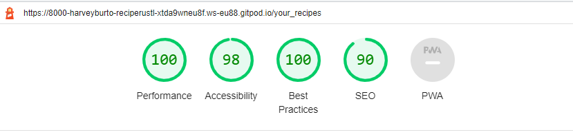

# Recipe Rustlers

This website was created with the purpose to help people find their new favourite recipes. Users logged in will be able to share their favourite recipes with the community and create a list of the recipes they have liked. 

(live version here)

***

## User Experiences
### First time user goal
- To see all published recipes on the website. By most liked and most recent.
- To be able to search the website for recipe titles. 
- To click on a recipe and to see the full instructions and ingredients. They will also be able to see the comments written by other users of the website.

### Signed in user goal
- To be able to take part in discussion underneath recipes. 
- To be able to add their own recipe add to set it live to be seen by other users of the website.
- To be able to edit or delete anything they have added to the website.

***

## User Stories

- Manage recipes: As a Admin I can CRUD recipes so that I can manage the website
- View comments: As a Site User / Admin I can view comments on individual recipes so that I can see the response from the community
- View likes: As a Site user / Admin I can view the number of likes on each recipe so that I can see the most popular
- Draft recipes: As a Site user I can draft my recipes I wish to add so that I don't have to complete the task in one sitting
- Site list: As a Site User I can view a list of recipes so that I can select one to read
- Open a recipe: As a Site User I can click on a recipe so that I can view the full recipe
- Account registration: As a Site User I can register an account so that I can comment and like and post my own recipes
- Comment on a recipe: As a Site user I can leave comments on a recipe so that I can let the community know about my experience
- Like / unlike: As a Site user I can Like and unlike a recipe so that I can interact with the content

***

## Agile development 

To record my agile development, I used the inbuilt projects in GitHub to track my User stories.

***

## Mock-ups 

At the conception of the project, I created three mock-ups of the key pages so I could define the style I wanted to go with. I didn't create mock-ups of the other pages as most where small changes to one of the three pages I had already made mock-ups for.

- ### Mock-up of homepage

- ### Mock-up of popular recipe page

- ### Mock-up of detailed recipe page

***

## Features

- ### Navbar and Footer
    - #### Navbar
        - Positioned at the top of the page the navbar will always be visible to the user. Allowing them to always be able to navigate the website with speed.
        - The navbar is always displayed at the top of the screen even if the user scrolls down the page.
        - The tabs Recipe Rustler, New recipe, Popular recipes, Register, Login, Hearted recipes, Add a recipe, Your recipes, and Logout each contain a link takes the user to a unique page.
        - When the user hovers over a link the background colour of the button changes to a different colour to show which tab they will be selecting.
        - The search bar allows the user to search for the name of all recipes on the website if they are after a particular dish.
        - The navbar will also collapse down to a dropdown list access by a button when the screen size falls below a specified width.
        

        - ##### Navbar not signed in
            - When the user is not signed in the navbar shows a reduce number of tabs these are: Recipe Rustler, New recipe, Popular recipes, Register, Login, and the search function.
            - The reason these tabs are shown is because they do not require the user to have an account to access the pages the links go to. 
            

        - ##### Navbar signed in
            - When the user has an account and is signed in the navbar shows the tabs: Recipe Rustler, New recipe, Popular recipes, Hearted recipes, Add a recipe, Your recipes, Logout and the search function.
            

    - #### Footer
        - Positioned at the bottom of the screen the footer contains the information on when the website was created and links to social media accounts shown by their logos for users to engage even more with the community. 
        - When the user hovers over one of the social media accounts the logo change colour to show the user which website they will go to. 
        - As these links are not part of our website when clicked they will open in a different tab allowing the user to remain on our website.
        

- ### Home page
    - #### Hero images
        - This is positioned just underneath the Navbar. It is a collage of bright and colourful pictures of images. 
        - These images should peak the users interest for more taste recipes and keep them on the site.
        

    - #### Title and ethos
        - The title and ethos introduce the user the website. It also explains why this website exists and includes the company slogan.
        
    
    - #### Twelve random recipes
        - This part of the homepage loads twelve random recipes to give the user an overview of the type of recipes on the site. 
        - Each of the twelve recipes are in an individual card showing the overall information e.g the image, title, dish type, prep and cooking time, author, date recipe was created, and number of likes. This allows the user to quickly get an impression of each of the recipes shown. 
    
            

- ### New recipes 
    - This page orders all recipes added to the website by the most recent to earliest. 
    - This page has a pagination of 12 as to not overload the user and displays a next and previous button at the bottom of the page when appropriate.
    

- ### Popular recipes
    - This page orders all recipes added to the website by the most likes. 
    - This page has a pagination of 12 as to not overload the user and displays a next and previous button at the bottom of the page when appropriate.
    

- ### Hearted recipes
    - This page is only shown to users logged in. It shows a list of recipes they have liked so they can easily find recipes they have enjoyed. 
    - The recipes on this page are organised by title.
    - This page has a pagination of 12 as to not overload the user and displays a next and previous button at the bottom of the page when appropriate. As this account has only liked five recipes the next button has not appeared.

        

- ### Recipe details
    - This page shows when a user clicks on a recipe title. 
    - The user if they are signed in are able to click on the heart to like the recipe once the recipe is liked by the user the heart fills in. This can be clicked on again to remove the users like if they have changed their mind on the recipe.
    - This then displays the overview information along with the instructions and ingredients for the recipe. 
    - At the bottom of the page the comments are recorded. They show the comment, poster and the date the comment was posted. It is ordered by the earliest comment posted to latest comment. This allows the user to read the comments as they were written. 
    - The ability to post a comment is next to the comments however this only appears when the user is logged into their account. 
    - If the user posts a comment the comment will have two buttons below it one to update their comment and one to delete there comment. This means if they wish to change what they've said or remove their comment altogether that they have the freedom to do so. 
    

    - #### Delete comment
        - If the user clicks on the delete option for their comment a pop-up appears asking them to confirm they wish to delete the comment. This stops users accidently deleting their comments. Once clicked it takes the user back to the home page. 

            

    - #### Update comment
        - If the user clicks to update their comment they are taken to a new page. Here the comment is filled out so the user can edit an individual part of their comment instead of having to write the entire comment again. They then select 'Update' and are taken back to the home page. 
        

- ### Add a recipe 
    - This page allows a signed in user to add their own recipe. One this page they first fill out the overview information. 
    - They fill out the title explaining what the recipe is. 
    - The image is next, if no image is uploaded then a filler 'no-image' is displayed for the recipe.
    - Status is the option between 'Draft' and 'Published'. If 'Draft' is selected, then the recipe is not visible to the other user of the website. If 'Published' is selected, then the recipe is shown like the other published recipes. 
    - Servings is to explain how many the recipe will feed.
    - Dish is an option between: 'Breakfast', 'Lunch', 'Snack', 'Dinner', and 'Dessert'. This helps other users to know what a recipe is for. 
    - Finally, is prep and cook time in minutes. 
    - The submit button takes the user to the next page for the ingredient and instruction sections.
     

- ### Add a recipe detail
    - Once the 'Add a recipe' has been completed. This page is shown, it displays the overview information at the top in the same layout as the 'Recipe detail' page. This is to keep consistence across the website.
    - Next is ingredients which are added by ingredient name, weight, and unit. When each ingredient is added by pressing the 'Add +' button it is shown to the right of the screen. This is so the user can keep track of which ingredients they have added. 
    - Next is instructions which are added by 'step' then 'detail' this is also displayed to the right once the 'Add +' is pressed. This is so the user can keep track of which instructions they have added. 
    - Below the top of the screen is a 'Save recipe' button once the ingredients and instructions have been added. This takes the user to the 'Your recipes' page.
    
    

- ### Your recipes 
    - This page shows the user all their created recipes both Drafts and Published. This lets the user pick up a draft recipe if they don't have time to finish adding the recipe in one sitting. 
    - The recipes are shown by alphabetical order by their titles. 
    - This page has a pagination of 12 as to not overload the user and displays a next and previous button at the bottom of the page when appropriate. As this user has only added two recipes the next button has not appeared. 
    

- ### Your recipes detail
    - This page is only accessed through the Your recipe page. This page lets the user edit or delete the recipe overview or each individual instruction and ingredient.
    
    

    - #### Update recipe overview
        - The 'Update recipe overview' button takes you to this page. 
        - This page shows the form for the recipe overview. It is filled in with the existing data to save the user from re-entering the data. 
        - Once the data has been updated the user can click the 'Update' button and it will take the user back to the 'Your recipes' page. 
        

    - #### Delete recipe
        - If the user clicks on the 'Delete recipe' option for their recipe a pop-up appears asking them to confirm they wish to delete the recipe. This stops the users accidently deleting their recipe. Once clicked it takes the user back to the 'Your recipe' page.

            

    - #### Add Instructions or Ingredients
        - If a user clicks on the 'Add Instructions or Ingredients' it takes them to the 'Add a recipe details'. 

            

    - #### Update instructions 
        - The 'Update' button takes you to this page. 
        - This page shows the form for the instruction. It is filled in with the existing data to save the user from re-entering the data. 
        - Once the data has been updated the user can click the 'Update' button and it will take the user back to the 'Your recipes' page. 
        

    - #### Delete instructions 
        - If the user clicks on the 'Delete' option for their instruction a pop-up appears asking them to confirm they wish to delete the instruction. This stops the users accidently deleting their instruction. Once clicked it takes the user back to the 'Your recipe' page.

            

    - #### Update ingredients 
        - The 'Update' button takes you to this page. 
        - This page shows the form for the ingredient. It is filled in with the existing data to save the user from re-entering the data. 
        - Once the data has been updated the user can click the 'Update' button and it will take the user back to the 'Your recipes' page. 
        

    - #### Delete ingredients 
        - If the user clicks on the 'Delete' option for their ingredient a pop-up appears asking them to confirm they wish to delete the ingredient. This stops the users accidently deleting their ingredient. Once clicked it takes the user back to the 'Your recipe' page.

            

- ### Search bar 
    - If the user searches for a recipe it will take them to this page. 
    - This page has a pagination of 12 as to not overload the user and displays a next and previous button at the bottom of the page when appropriate. As this search has only shown one recipe the next button has not appeared. 
    

- ### Register
    - If the user chooses to register for an account, they are offered a link to the sign in page in case they have already made an account.
    - The register page was created using allauth which contains validations to make sure the data the user enters is correct and that the password is complex enough. 
    - The user can choose a username that is displayed on their interactions on the website. 

        

- ### Sign in
    - If the user clicks login a link is offered to the Register page in case they don't already have an account.
    - The page was created using allauth which validates the username and password match.
    

- ### Logout
    - If the user clicks logout the page asks, the user if they are sure they wish to loggout.

        

***

## Data schema 

***

## Surface 

- ### Colours
    - Background colour of body #91AA9D and text colour of black these both contrast well with a contrast ration of 8.44 : 1.
    - Background colour of navbar, footer, card backgrounds and buttons: #193441 with a text colour of white these both contrast well with a contrast ration of 13.05 : 1.
    - A hover colour of #3E606F with a text colour of white these both contrast well with a contrast ration of 6.76 : 1.

- ### Fonts
    The fonts used for the h1, h2, h3, h4, h5 is Poppins with a backup of Open Sans. The font used for the rest of the text is Comfortaa with a backup of PT Sans.

- ### Images
    The images were found on [pexels.com](https://www.pexels.com/) and the recipe images were found on [bbcgoodfood.com](https://www.bbcgoodfood.com/). The image source is in the [credits section](##Credits).

***

## Technologies used
- Python
- HTML
- CSS
- Django 
- Bootstrap 
- Font awesome 
- Google fonts 
- Git / GitHub / GitPod
- Cloudinary
- Gunicorn 
- Heroku 
- ElephantSQL 
- Summernote 

***

## Testing 

- ### Code validator 

   - #### Python code
        Checking the validation embedded in the [Code institute org/ gitpod full template](https://github.com/Code-Institute-Org/gitpod-full-template).
        All issues have been resolved baring the 'line too long'.

    - #### HTML code
        Checked with the Markup Validation Service and no errors where found.
        

    - #### CSS code
        Checked with the CSS Validation Service and no errors where found.
        

- ### Lighthouse

    - Homepage

    

    - New recipes page

    

    - Popular recipes page

    

    - Recipe details page

    

    - Your recipes page

    

    - Add a recipe page

    

    - Add a recipe detail page

    

- ### Manual testing

    I have tested this website throughout development on a number of different sized screens to make sure the website works correctly, and the style is consistent. I have used the user stories to do my manual testing. 

    [All user stories can be found here](##User-Stories)

    - #### Manage recipes
        In the admin panel I am able to add, edit, remove, and view all data in the models. 
        

    - #### View comments
        In the recipe detail view you can see all comments added to that recipe in the comment section.
        

    - #### View likes
        In the recipe overview you can view the number of likes each recipe has.

        

    - #### Draft recipes
        In the add a recipe page you can select 'Draft' or 'Published' and if 'Draft' is selected the recipe only appears in 'Your recipes' tab where you can continue to edit on the recipe.
        

    - #### Site list
        All published recipes are viewable into different orders either by newest or most popular. 
        

    - #### Open a recipe
        All published recipes can be clicked on to open up the recipe detail page. 
        

    - #### Account registration
        A user can create an account by clicking on the register tab or log into an existing account by the sign in tab.

        

    - #### Comment on a recipe
        A signed in user can create a comment on any recipe and are able to edit or delete the comment once posted. 
        

    - #### Like / unlike
        A signed in user can like and remove their like on any recipe. When the recipe is liked the heart is filled in and if the recipe is not liked the heart is hollow.

        
        

- ### Issues found during development

    - #### Author Id issue
    When I created the add a recipe form the user could choose the username. As this isn't very secure, I tried to get the username of the current user to be saved as the Author. However, with this code.
    

    It was producing this error when I tried to save the recipe.

    

    I found the solution was to include 'instance' between form.author to capture the current user.

    

    - #### Loved recipes
    When creating the Hearted recipes tab, I could not get the page to pull through any recipes the user had liked. This was the code at the time.

    

    With the help of my mentor, we were able to find the issue was the queryset was set to the wrong objects. Once that was amended the page loaded correctly. This is the fixed code. 
    

***

## Deployment 

***

## Credits
- ### Code, Ideas and knowledge 
    - I used Code Institute student template: [gitpod-full-template](https://github.com/Code-Institute-Org/gitpod-full-template)
    - Code institute Diploma in Full Stack Software Development (Common Curriculum) course
    - Code was used from the 'I think therefore I blog' module.
    - [w3schools](https://www.w3schools.com/)
    - [The codemy youtube channel](https://www.youtube.com/@Codemycom)
    - My Mentor Adegbenga Adeye

- ### Content
    - #### Images for the front page
        - [Photo by Ella Olsson from Pexels](https://www.pexels.com/photo/top-view-of-food-1640772/)
        - [Photo by Valeria Boltneva from Pexels](https://www.pexels.com/photo/burger-with-fried-fries-on-black-plate-with-sauce-on-the-side-1199957/)
        - [Photo by Steve from Pexels](https://www.pexels.com/photo/stainless-steel-spoon-on-black-ceramic-bowl-3789885/)
        - [Photo by JAN N G U Y E N 🍁 from Pexels](https://www.pexels.com/photo/noodles-with-meat-and-mint-on-top-2664216/)
        - [Photo by Ash from Pexels](https://www.pexels.com/photo/pancake-with-sliced-strawberry-376464/)
        - [Photo by Engin Akyurt from Pexels](https://www.pexels.com/photo/pasta-on-white-plate-on-focus-photo-1527603/)

    - #### Recipes
        - [Coconut squash dhansak](https://www.bbcgoodfood.com/recipes/coconut-squash-dhansak)
        - [Easy vegetarian chilli](https://www.bbcgoodfood.com/recipes/easy-vegetarian-chilli)
        - [Alfredo sauce](https://www.bbcgoodfood.com/recipes/alfredo-sauce)
        - [Beef rissoles](https://www.bbcgoodfood.com/recipes/beef-rissoles)
        - [Slow cooker pork shoulder](https://www.bbcgoodfood.com/recipes/slow-cooker-pork-shoulder)
        - [One pot garlic chicken](https://www.bbcgoodfood.com/recipes/one-pot-garlic-chicken?dicbo=v2-bpnhpkr)
        - [Crispy sesame lemon chicken](https://www.bbcgoodfood.com/recipes/crispy-sesame-lemon-chicken)
        - [Prawn harissa spaghetti](https://www.bbcgoodfood.com/recipes/prawn-harissa-spaghetti)
        - [Smoky steak cajun potatoes spicy slaw](https://www.bbcgoodfood.com/recipes/smoky-steak-cajun-potatoes-spicy-slaw)
        - [Pork chops mustardy butter beans](https://www.bbcgoodfood.com/recipes/pork-chops-mustardy-butter-beans)
        - [Satay chicken rice bowl](https://www.bbcgoodfood.com/recipes/satay-chicken-rice-bowl)
        - [Chocolate chip muffins](https://www.bbcgoodfood.com/recipes/chocolate-chip-muffins)
        - [Simple iced biscuits](https://www.bbcgoodfood.com/recipes/simple-iced-biscuits)
        - [Easy banana pancakes](https://www.bbcgoodfood.com/recipes/easy-banana-pancakes)
        - [Vegan breakfast muffins](https://www.bbcgoodfood.com/recipes/vegan-breakfast-muffins)
        - [Egg hole bacon sandwich](https://www.bbcgoodfood.com/recipes/egg-hole-bacon-sandwich)
        - [Sweet potato hash eggs smashed avo](https://www.bbcgoodfood.com/recipes/sweet-potato-hash-eggs-smashed-avo)
        - [Smash burgers](https://www.bbcgoodfood.com/recipes/smash-burgers)
        - [Mixed fruit tart](https://www.bbcgoodfood.com/recipes/mixed-fruit-tart)
        - [Best ever chocolate brownies recipe](https://www.bbcgoodfood.com/recipes/best-ever-chocolate-brownies-recipe)
        - [Sausage pasta bake](https://www.bbcgoodfood.com/recipes/sausage-pasta-bake)
        - [All one chicken traybake](https://www.bbcgoodfood.com/recipes/all-one-chicken-traybake)
        - [Versatile beef stew](https://www.bbcgoodfood.com/recipes/versatile-beef-stew)
        - [Pepperoni pizza rolls](https://www.bbcgoodfood.com/recipes/pepperoni-pizza-rolls)

***